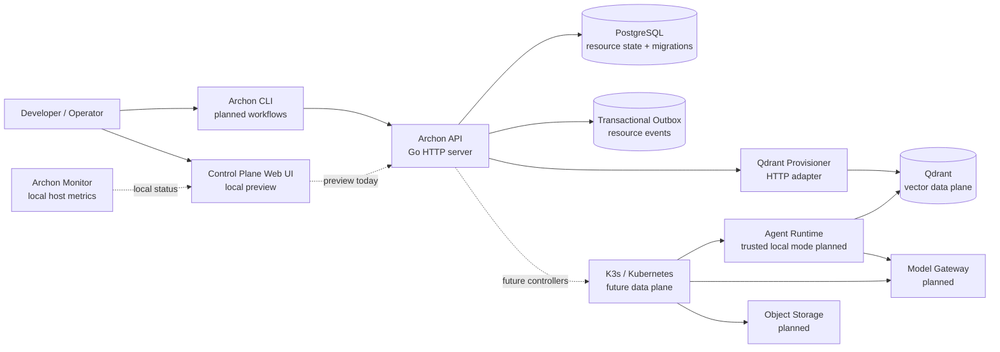
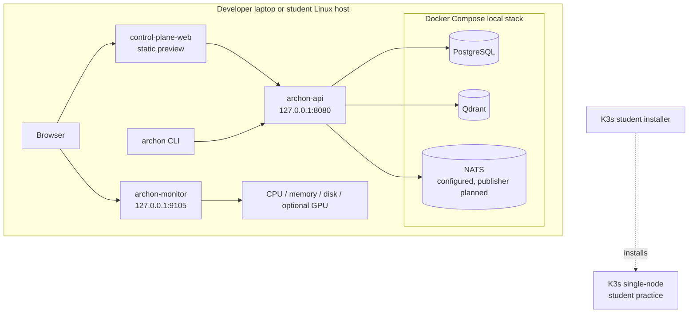
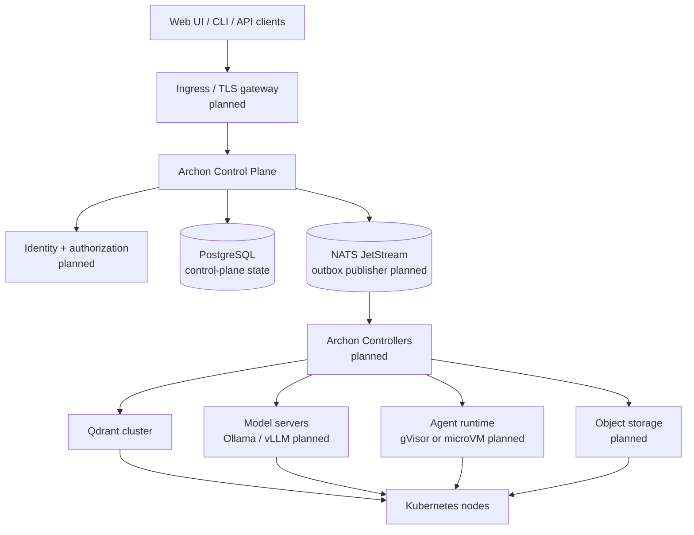
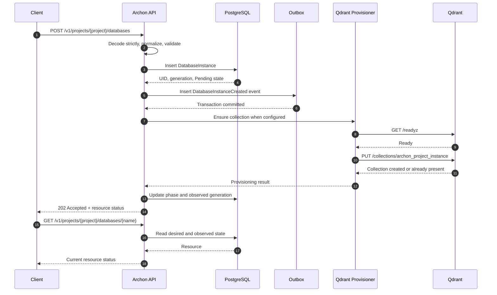
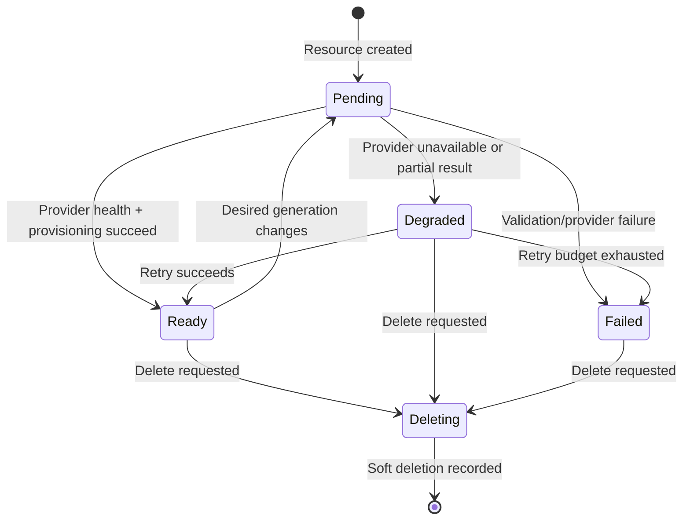
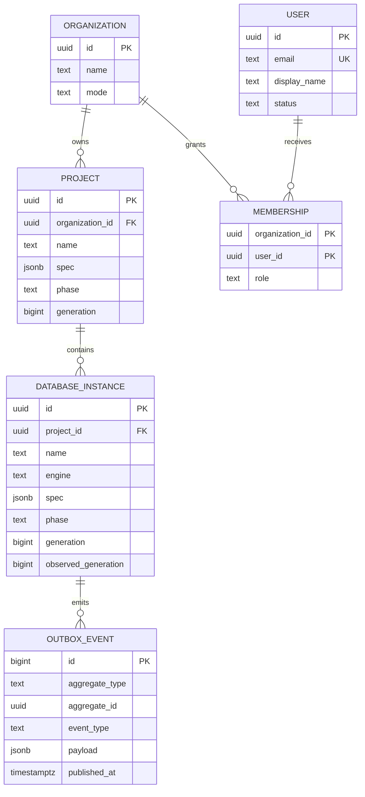
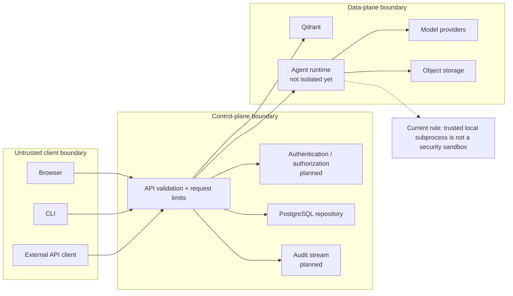

# Archon Base Architecture

**Architecture status:** Early Access foundation  
**Current release boundary:** local control plane, PostgreSQL resource state, optional Qdrant provisioning, student/K3s tooling, and identity foundation  
**Not yet production-ready:** authentication, authorization, Kubernetes controllers, agent isolation, multi-tenancy, and high availability

## 1. Product architecture at a glance

Archon Base is designed as a control plane for self-hosted AI infrastructure. The control plane stores desired resources and coordinates provisioning; the data plane runs the actual databases, model servers, agents, and workloads.



### Current implementation boundary

The solid path is the current Early Access foundation:

```text
HTTP client/API request
        ↓
Go API validation and handlers
        ↓
PostgreSQL repository
        ↓
Project/DatabaseInstance state + outbox event
        ↓
Optional Qdrant HTTP provisioner
        ↓
Qdrant collection
```

The dashed paths are planned or preview-only and must not be presented as shipped functionality.

## 2. Runtime deployment topology

### Local development and student profile



### Intended self-hosted cluster topology



## 3. Control-plane request flow



### Resource state model



## 4. Data model and ownership



### Identity status

The identity migration creates `users` and `organization_memberships` with owner/admin/operator/developer/viewer roles. It is a storage foundation only.

Authentication and authorization must be implemented before member-management mutations or project-scoped access are exposed. The current single-organization local mode is not multi-tenant production security.

## 5. Security boundaries



Current security rules:

- API binds to `127.0.0.1:8080` by default.
- Qdrant and PostgreSQL should remain private to the local stack or cluster network.
- Request bodies are size-limited.
- Request IDs and structured access logs are available.
- Secrets and prompt redaction still need to be completed throughout all future runtimes.
- User/membership data exists, but authentication and authorization are not complete.
- Do not expose trusted local agent execution to untrusted users.

## 6. Repository-to-architecture map

| Architecture area | Repository location | Current status |
|---|---|---|
| API entrypoint | `cmd/archon-api/main.go` | Implemented with PostgreSQL, migrations, readiness, and optional Qdrant wiring |
| HTTP API | `internal/server/` | Project and DatabaseInstance CRUD plus health/readiness endpoints |
| Resource contracts | `internal/api/` | Project, DatabaseInstance, User, Membership, validation |
| PostgreSQL repository | `internal/store/` | Project/DatabaseInstance persistence and status updates |
| Migration runner | `internal/db/` | Ordered, idempotent forward migration runner |
| Core schema | `migrations/001_core_resources.sql` | Projects, DatabaseInstances, outbox |
| Identity schema | `migrations/002_identity_foundation.sql` | Users and organization memberships; auth gate remains |
| Qdrant adapter | `internal/provision/qdrant.go` | Health, deterministic collection provisioning, deletion |
| Local monitor | `cmd/archon-monitor/`, `internal/monitor/` | Host resource status and Prometheus metrics |
| Web console | `control-plane-web/` | Modular local preview; real API integration remains next |
| K3s installer | `scripts/install-k3s-student.sh` | Student/enthusiast single-node installation |
| Kubernetes package | `deploy/helm/` | Early skeleton; not production-ready |
| Python SDK | `sdk/python/` | Public shape/stubs; runtime bindings remain planned |

## 7. Near-term architecture sequence

The safest implementation order is:

```text
1. Qdrant adapter and real resource status
2. API-backed dashboard for Projects and DatabaseInstances
3. Local CLI and one-command dev runtime
4. Authentication and session management
5. Authorization and project-scoped membership checks
6. Authenticated Admin Panel user management
7. Outbox publisher and reconciliation worker
8. Kubernetes controllers and Helm hardening
9. Agent runtime security boundary
10. Models, storage, RAG, tools, and enterprise features
```

Each future capability should follow this lifecycle:

```text
contract → migration → repository → API → reconciliation → UI
→ authentication → authorization → audit → tests → documentation
```

## 8. Architecture status legend

- **Available:** implemented and tested in the current repository.
- **Preview:** visible in the local UI or supported in a limited local mode.
- **Planned:** design target, not available for production use.
- **Degraded:** the component is present but a dependency or capability is unavailable.
- **Unsupported:** intentionally rejected in the current milestone.
